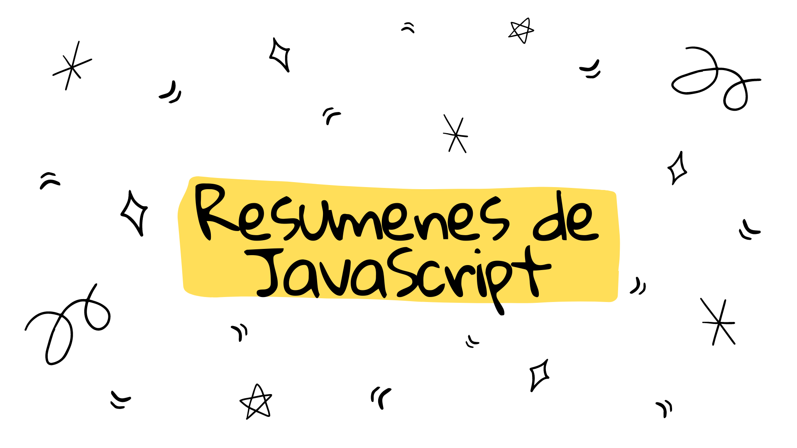

  
  
   
¡Hola compañerx cibernauta 👩‍🚀! He creado este repositorio con una recopilación de temas y conceptos de JavaScript que he resumido. Eres libre de usarlos y estudiar con ellos (si ves algún error o algo que mejorar, no dudes en hacer un pull request o ¡mandarme un dm en  <a class="header-badge" target="_blank" href="https://twitter.com/gerig_thamara">
   twitter</a>!)

   
También estoy construyendo otro 
   repositorio sobre <a class="header-badge" target="_blank" href="https://github.com/thamaragerigr/Preguntas-de-Entrevista">
   preguntas de entrevista</a> 🤸‍♀️

   ¡Te deseo suerte en tu viaje🧑‍🚀!

  <h3 align="left">Tabla de contenidos</h3>

 <ul align="left">
   <li><a href="./Tipos de Valores (data types).md"> Tipos de Valores (data types)</a></li>
   <li><a href="./Variables, tipos y su scope.md">Variables, tipos y su scope</a></li>
    <li><a href="./Condicionales y operadores lógicos.md">Condicionales y operadores lógicos</a></li>
    <li><a href="./Métodos de Arrays.md">Métodos de Arrays</a></li>
    <li><a href="./Funciones.md">Funciones</a></li>
    <li><a href="./OOPvsFP.md">Programación orientada a objetos vs Programación funcional</a></li>
    <li><a href="./Promesas.md">Promesas</a></li>
    <li><a href="./Constructors.md">Constructors</a></li>
    <!-- <li><a href="./Cómo funciona js.md">Cómo funciona js (Hoisting/Stack)</a></li>
    <li><a href="./AsyncAwait.md">Async/ Await</a></li>
    <li><a href="./Bonus: Git basics.md">Bonus: Git Basics</a></li> -->
     <li>Y continuará...</a></li>
 </ul>
  

